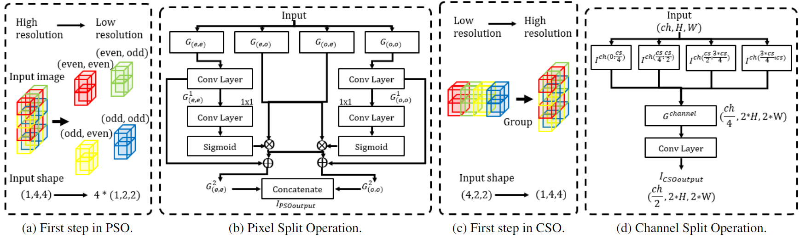

# Split operation to improve encoder-decoder operation for inpainting

So far, Many inpainting models have been studied. These models utilize additional information or networks (e.g., landmark, edge, style, and filter) to improve the restoration performance. However, these developments cause the problem of increasing computer resources. To solve this problem, some researchers investigate the efficient structure model (e.g., recurrent structure, and residual connection structure) which consists of encoder-decoder structure. Eventually, additional networks are utilized to increase the performance of the efficient structure model.
In this situation where the network structure is getting larger, we thought about how to reduce the parameters of model and improve the performance. As a result, we propose split operation to improve encoder-decoder operation for inpainting. As far as we know, this is the first study to develop encoder-decoder operation. 
To achieve this goal, we investigated the existing up sampling operation and down sampling operation that make up encoder-decoder structure. Then we defined Pixel Split Operation (PSO) and Channel Split Operation (CSO) for improving encoder-decoder operation, and discussed how to effectively apply these two operations.
To validate the effect of split operations, five metrics(PSNR, L1, SSIM, LPIPS, and FLOPs) evaluated the restoration performance  and the complexity of model on public datasets such as Place2 and CelebA. Furthermore, an ablation study was conducted to confirm the effect of the split operation on CelebA-HQ.

<br><br>


## Prerequisites
- Python 3
- PyTorch >= 1.0

## Dataset

- [Places2 Data of Places365-Standard](http://places2.csail.mit.edu/download.html)
- [CelebA](https://mmlab.ie.cuhk.edu.hk/projects/CelebA.html)
- [Mask](https://nv-adlr.github.io/publication/partialconv-inpainting)

1. For data folder path (CelebA) organize them as following:

```shell
--CelebA
   --train
      --1-1.png
   --valid
      --1-1.png
   --test
      --1-1.png
   --mask-train
	  --1-1.png
   --mask-valid
      --1-1.png
   --mask-test
      --0%-20%
        --1-1.png
      --20%-40%
        --1-1.png
      --40%-60%
        --1-1.png
 ```

 2. Run the code  `./data/data_list.py` to generate the data list

## Architecture details

<br><br>


## Pretrained models

[CelebA](https://drive.google.com/file/d/1AaO3x97GliNbEHCdWSS3dm9I9Ft224gd/view?usp=share_link)

[Places2](https://drive.google.com/file/d/1qGkTExDZ0TnJMZXO9P4ARDHf5dj9zATM/view?usp=share_link)

## Train

python train.py
<br>
For the parameters: checkpoints/config.yml

## Test

Such as test on the face dataset, please follow the following:
1. Make sure you have downloaded the "celebA_InpaintingModel_dis.pth" and "celebA_InpaintingModel_gen.pth" and put that inside the checkpoints folder.
2. Change "MODEL_LOAD: celebA_InpaintingModel" in checkpoints/config.yml.
3. python test.py #For the parameters: checkpoints/config.yml


## Results

- Comparsion with SOTA, see paper for details.


**More details are coming soon**

## Bibtex

```


```

## Acknowledgments
Parts of this code were derived from:<br>
https://github.com/tsingqguo/efficientderain <br>
https://github.com/knazeri/edge-connect
